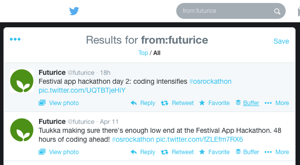
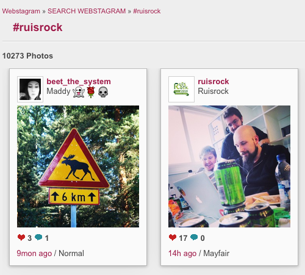
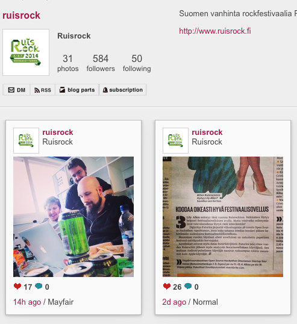
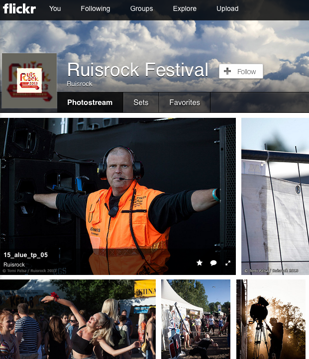
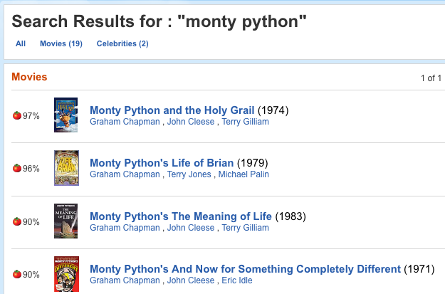
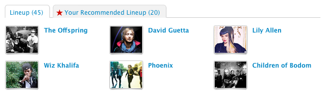
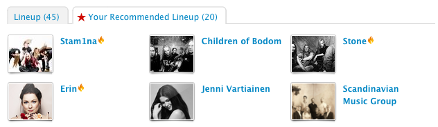

Service integrations
====================

This is the documentation for all of the 3rd party services that are integrated and easily accessible with internal APIs.

We currently have some integrations to the following services:

=======
[](http://twitter.com)

[](http://instagram.com)

[](http://flickr.com/)

[](http://www.imdb.com/)

[](http://www.rottentomatoes.com)

[](http://last.fm/)

# [OpenWeatherMap](http://openweathermap.org/)

----

## API Documentation

### Twitter

In order for the API to work, you must have the following environmental variables set:

```
TWITTER_API_KEY
TWITTER_SECRET
```

#### Full-text search

You want to find all mentions of your event's name for example:


`GET /api/v1/twitter/search/:search-term/:limit`

Note: The `:limit` is optional, you can omit it and you will get by default 10 results.

Example:
`GET /api/v1/twitter/search/ruisrock/2`


**Response**
```json
[
  {

    "tweet": "RT @NirvanaNews: Kurt Cobain live at Ruisrock in Finland, 1992. #Nirvana http://t.co/1XVsDqjCmb",
    "user": {
      "name": "Papadopoulos",
      "img": "https://pbs.twimg.com/profile_images/451786402154704896/nr7B94A5_normal.jpeg",
      "handle": "mayradi06"
    },
    "created_at": "Sun Apr 13 07:20:47 +0000 2014"
  },
  {
    "tweet": "PAKKO PÄÄSTÄ RUISROCK",
    "user": {
      "name": "speedo",
      "img": "https://pbs.twimg.com/profile_images/453627157311660033/pYlTR5tQ_normal.jpeg",
      "handle": "donchki"
    },
    "created_at": "Sun Apr 13 06:13:46 +0000 2014"
  }
]
```

#### Twitter single user's timeline

You want to show your event's twitter account feed




`GET /api/v1/twitter/user/:twitter-handle/:limit`

Example:
`GET /api/v1/twitter/user/futurice/2`

```json
[
  {
    "tweet": "RT @spaceshipfin: Tampere site is currently Space Bowling! Thanks @Futurice for the place and drinks! @spaceapps #tampere #spaceship14 http…",
    "user": {
      "name": "Futurice",
      "img": "https://pbs.twimg.com/profile_images/378800000710507935/ee3c64bbf7da2c08f275049b411fad96_normal.png",
      "handle": "futurice"
    },
    "created_at": "Sat Apr 12 19:40:30 +0000 2014"
  },
  {
    "tweet": "RT @elnygren: #osrockhathon half-way demo -all the keywords you need:#restful #api #mongodb #nodejs  #android #ios #mobile #html5 @futurice…",
    "user": {
      "name": "Futurice",
      "img": "https://pbs.twimg.com/profile_images/378800000710507935/ee3c64bbf7da2c08f275049b411fad96_normal.png",
      "handle": "futurice"
    },
    "created_at": "Sat Apr 12 19:39:54 +0000 2014"
  }
]
```

#### Twitter hashtag search

You want to follow your event's hashtag


`GET /api/v1/twitter/hashtag/:hashtag/:limit`

Example:
`GET /api/v1/twitter/hashtag/osrockathon/2`

```json
[
  {
    "tweet": "RT @lsnellma: #osrockathon @yhteisomanageri in motion http://t.co/G9XiJCMrfy",
    "user": {
      "name": "Yhteisömanageri.fi",
      "img": "https://pbs.twimg.com/profile_images/3341435443/fa3021daecf20c35916b3e17d0840ffb_normal.jpeg",
      "handle": "yhteisomanageri"
    },
    "created_at": "Sun Apr 13 07:43:19 +0000 2014"
  },
  {
    "tweet": "#osrockathon day 3. Dead silent at venue. Must've been a good sauna! Time to refactor and maybe create a sexy demo out of JSON data :)",
    "user": {
      "name": "Jan Wikholm",
      "img": "https://pbs.twimg.com/profile_images/438729065202073600/mociQuEg_normal.jpeg",
      "handle": "unfo"
    },
    "created_at": "Sun Apr 13 06:46:59 +0000 2014"

  }
]
```


### Instagram API

In order for the API to work, you must have the following environmental variables set:


```
IGCLIENTID = Instagram Client Id
IGCLIENTSECRET = Instagram Client Secret
IGHASHTAG = Instagram hashtag used for search
IGUSERID = Instagram userid used for search
```

#### Instagram hashtag search

You want to follow your event's hashtag:



`GET /api/v1/instagram/tag`

Note: The API does not yet provide searching on variable usernames, just the hard-coded event hashtag.

**Response**

```json
{"media": [
  {
    "link": "http://instagram.com/p/msWC-pvrid/",
    "title": "Kesäks tekemistä ;) #summer#ruisrock2014#cheek#kalajoenjuhannus2014",
    "thumbnail": "http://origincache-ash.fbcdn.net/10249176_360276410780322_378010268_s.jpg",
    "small_image": "http://origincache-ash.fbcdn.net/10249176_360276410780322_378010268_a.jpg",
    "image": "http://origincache-ash.fbcdn.net/10249176_360276410780322_378010268_n.jpg",
    "likes": 4,
    "tags": ["summer", "cheek", "kalajoenjuhannus2014", "ruisrock2014"]
  },
  {
    "link": "http://instagram.com/p/mpQFUAB4Sc/",
    "title": "Jihaa 😜 #ruisrock#ruisrock2014#davidguetta#jeij#summer#oij#so#happy",
    "thumbnail": "http://origincache-prn.fbcdn.net/1515806_769145636436500_1191608933_s.jpg",
    "small_image": "http://origincache-prn.fbcdn.net/1515806_769145636436500_1191608933_a.jpg",
    "image": "http://origincache-prn.fbcdn.net/1515806_769145636436500_1191608933_n.jpg",
    "likes": 11,
    "tags": ["ruisrock2014", "oij", "jeij", "davidguetta", "summer", "ruisrock", "so", "happy"]
  }
]}
```

#### Instagram user feed



`GET /api/v1/instagram/user`

**Response**

```json
{"media": [
  {
    "link": "http://instagram.com/p/mpGqifp50C/",
    "title": "Tänään alkaa #Hackhaton-viikonloppu. Kaikki innokkaat devaajat mukaan kehittämään Ruisrockin festivaaliappia entistä paremmaksi. #opensource #futurice",
    "thumbnail": "http://distilleryimage2.s3.amazonaws.com/e5964972c14e11e3ac4b0002c9d01986_5.jpg",
    "small_image": "http://distilleryimage2.s3.amazonaws.com/e5964972c14e11e3ac4b0002c9d01986_6.jpg",
    "image": "http://distilleryimage2.s3.amazonaws.com/e5964972c14e11e3ac4b0002c9d01986_8.jpg",
    "likes": 26,
    "tags": ["hackhaton", "opensource", "futurice"]
  },
  {
    "link": "http://instagram.com/p/mo_BUdJ5_G/",
    "title": "Perjantaina 4.7. on bileet! #davidguetta esiintyy Ruisrockissa! #ruisrock",
    "thumbnail": "http://distilleryimage2.s3.amazonaws.com/8d1c6c3ec14611e3a99d0002c9d08736_5.jpg",
    "small_image": "http://distilleryimage2.s3.amazonaws.com/8d1c6c3ec14611e3a99d0002c9d08736_6.jpg",
    "image": "http://distilleryimage2.s3.amazonaws.com/8d1c6c3ec14611e3a99d0002c9d08736_8.jpg",
    "likes": 98,
    "tags": ["ruisrock", "davidguetta"]
  }
]}
```

### Flickr

```
FLICKRAPIKEY = Flickr API key
FLICKRHASHTAG = Flickr hashtag used for search
FLICKRUSERID = Flickr userid used for search

Optional:
FLICKRPERPAGE = Flickr feed size, default: 20
```

#### Flick hashtag search


`GET /api/v1/flickr/tag`

**Response**

```json
{"media": [
  {
    "id": "13666080965",
    "title": "Ruisrock 1993",
    "thumbnail": "http://farm4.staticflickr.com/3818/13666080965_b5401f3383_t.jpg",
    "image": "http://farm4.staticflickr.com/3818/13666080965_b5401f3383_z.jpg",
    "link": "http://www.flickr.com/photos/36973576@N08/13666080965"
  },
  {
    "id": "13353475384",
    "title": "Graveyard",
    "thumbnail": "http://farm4.staticflickr.com/3742/13353475384_840dd83c72_t.jpg",
    "image": "http://farm4.staticflickr.com/3742/13353475384_840dd83c72_z.jpg",
    "link": "http://www.flickr.com/photos/51387206@N08/13353475384"
  },
  {
    "id": "13353322263",
    "title": "Pet Shop Boys",
    "thumbnail": "http://farm8.staticflickr.com/7118/13353322263_2bcb941fbf_t.jpg",
    "image": "http://farm8.staticflickr.com/7118/13353322263_2bcb941fbf_z.jpg",
    "link": "http://www.flickr.com/photos/51387206@N08/13353322263"
  }
]}
```

#### Flickr user stream




`GET /api/v1/flickr/user`

```json
{"media": [
  {
    "id": "9248163282",
    "title": "15_alue_tp_05",
    "thumbnail": "http://farm3.staticflickr.com/2811/9248163282_ebc47580c2_t.jpg",
    "image": "http://farm3.staticflickr.com/2811/9248163282_ebc47580c2_z.jpg",
    "link": "http://www.flickr.com/photos/92696256@N06/9248163282"
  },
  {
    "id": "9245381649",
    "title": "15_alue_tp_04",
    "thumbnail": "http://farm8.staticflickr.com/7406/9245381649_7f3364b0f4_t.jpg",
    "image": "http://farm8.staticflickr.com/7406/9245381649_7f3364b0f4_z.jpg",
    "link": "http://www.flickr.com/photos/92696256@N06/9245381649"
  },
  {
    "id": "9245381755",
    "title": "15_alue_tp_03",
    "thumbnail": "http://farm4.staticflickr.com/3698/9245381755_2a14418e8b_t.jpg",
    "image": "http://farm4.staticflickr.com/3698/9245381755_2a14418e8b_z.jpg",
    "link": "http://www.flickr.com/photos/92696256@N06/9245381755"
  }
]}
```


### IMDb

Move title search


`GET /api/v1/imdb/:search`

Returns the best match for the `:search` term

Example:
`GET /api/v1/imdb/monty+python+and`

**Response**

```json
{
  "imdbid": "tt0071853",
  "imdburl": "http://www.imdb.com/title/tt0071853/",
  "genres": "Adventure,Comedy,Fantasy", 
  "languages": "English,French,Latin", 
  "country": "UK", 
  "votes": "286367", 
  "stv": 0, 
  "series": 0, 
  "rating": "8.4", 
  "runtime": "91min", 
  "title": "Monty Python and the Holy Grail", 
  "_year_data": "1975", 
  "usascreens": 26, 
  "ukscreens": 0, 
  "cacheExpiry": 1397984603
}
```

### Rotten Tomatoes

Movie title search for best match.



`GET /api/v1/rotten/:search`

Example:

`GET /api/v1/rotten/monty+python+holy`

```json

  

    {
        "total": 19,
        "movies": [
            {
                "id": "11450",
                "title": "Monty Python and the Holy Grail",
                "year": 1974,
                "mpaa_rating": "PG",
                "runtime": 92,
                "critics_consensus": "A cult classic as gut-bustingly hilarious as it is blithely ridiculous, Monty Python and the Holy Grail has lost none of its exceedingly silly charm.",
                "release_dates": {
                    "theater": "1975-01-01",
                    "dvd": "1999-09-07"
                },
                "ratings": {
                    "critics_rating": "Certified Fresh",
                    "critics_score": 97,
                    "audience_rating": "Upright",
                    "audience_score": 95
                },
                "synopsis": "",
                "posters": {
                    "thumbnail": "http://content7.flixster.com/movie/11/16/39/11163965_mob.jpg",
                    "profile": "http://content7.flixster.com/movie/11/16/39/11163965_pro.jpg",
                    "detailed": "http://content7.flixster.com/movie/11/16/39/11163965_det.jpg",
                    "original": "http://content7.flixster.com/movie/11/16/39/11163965_ori.jpg"
                },
                "abridged_cast": [
                    {
                        "name": "Graham Chapman",
                        "id": "162672158",
                        "characters": [
                            "Hiccoughing Guard",
                            "King Arthur",
                            "Three-Headed Knight"
                        ]
                    },
                    {
                        "name": "John Cleese",
                        "id": "162653372",
                        "characters": [
                            "Black Knight",
                            "French",
                            "Sir Lancelot"
                        ]
                    },
                    {
                        "name": "Terry Gilliam",
                        "id": "162653515",
                        "characters": [
                            "Old Man from Scene 24",
                            "Patsy/Soothsayer"
                        ]
                    },
                    {
                        "name": "Eric Idle",
                        "id": "162661127",
                        "characters": [
                            "Concorde",
                            "Guard",
                            "Maynard",
                            "Roger",
                            "Sir Robin"
                        ]
                    },
                    {
                        "name": "Terry Jones",
                        "id": "162672157",
                        "characters": [
                            "Dennis's Mother",
                            "Prin",
                            "Sir Bedevere",
                            "Three-Headed Knight"
                        ]
                    }
                ],
                "alternate_ids": {
                    "imdb": "0071853"
                },
                "links": {
                    "self": "http://api.rottentomatoes.com/api/public/v1.0/movies/11450.json",
                    "alternate": "http://www.rottentomatoes.com/m/monty_python_and_the_holy_grail/",
                    "cast": "http://api.rottentomatoes.com/api/public/v1.0/movies/11450/cast.json",
                    "clips": "http://api.rottentomatoes.com/api/public/v1.0/movies/11450/clips.json",
                    "reviews": "http://api.rottentomatoes.com/api/public/v1.0/movies/11450/reviews.json",
                    "similar": "http://api.rottentomatoes.com/api/public/v1.0/movies/11450/similar.json"
                }
            }
        ],
        "links": {
            "self": "http://api.rottentomatoes.com/api/public/v1.0/movies.json?q=monty+python&page_limit=1&page=1",
            "next": "http://api.rottentomatoes.com/api/public/v1.0/movies.json?q=monty+python&page_limit=1&page=2"
        },
        "link_template": "http://api.rottentomatoes.com/api/public/v1.0/movies.json?q={search-term}&page_limit={results-per-page}&page={page-number}"
    }


```

### Last.fm

In order for the API to work, you must have the following environmental variables set:

```
LASTFM_KEY
LASTFM_SECRET
LASTFM_EVENT_ID
```

#### Event's recommended artist lineup







`GET /api/v1/top-artists/:username`

```json
[
  {
    "name": "Stam1na",
    "playcount": 795
  },
  {
    "name": "Children of Bodom",
    "playcount": 528
  },
  {
    "name": "Erin",
    "playcount": 88
  },
  {
    "name": "Jenni Vartiainen",
    "playcount": 29
  },
  {
    "name": "Vesa-Matti Loiri",
    "playcount": 12
  }
]
```

#### Artist information

Only takes artist name and returns a JSON response with found results bound to the ArtistModel.

`GET /api/v1/lastfm/search/:artist`

### OpenWeatherMap

Get local weather for your event upt next 14 days at 3 hour intervals.

`GET /api/v1/weather/:city/:epoch-timestamp`

Note: `:timestamp` is optional and will by default just return the current weather.

Example:

`GET /api/v1/weather/helsinki/1397467133`

```json
{
  "temp":6.29,
  "weather":"sunny"
}
```
Where temp is in celsius and the weather one of the following:
'sunny','partly cloudy','cloudy','light rain','rain','heavy rain','storm','snow','fog'

Will return `"error"` if the result was invalid.


